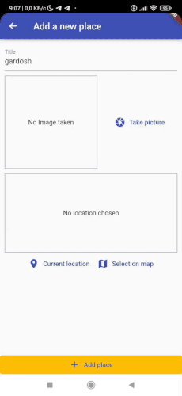
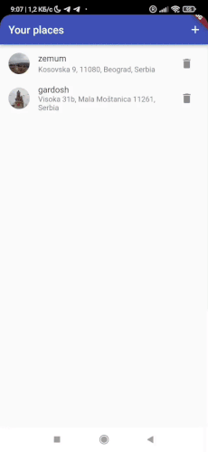
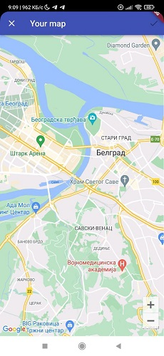
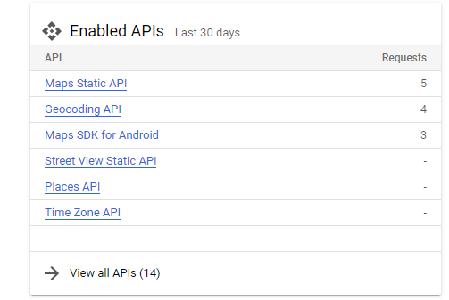

# Places App

The app allows a user to add favorite places to the list. The place must contain the name, photo and geolocation. There are two options for saving geolocation: current and selected on the map. After being added to the list, the user can see the geolocation of this place on the map at any time.

___
## Technical description

Flutter 3.3.10 • Dart 2.18.6

`flutter_bloc 8.1.1` library is used for implementing BLoC pattern.

Bloc with network repository is used for managing the list of places.

Storing data locally on the device is implemented using SQLite database (`sqflite` plugin).

Maps static API and geocoding API on **Google Maps Platform** are used to get geolocation data and addresses. In order to successfully call these APIs, you must be registered on the platform and use `googleApiKey` and `googleSignature`.
For security reasons, I removed these keys from the repository, so you will not be able to run the app with full functionality without your own keys.

Also, using the `flutter_launcher_icons` package and editing files in `android/app/src/main/res`, custom app icons and splash screen are added. 
___
## Useful links
[Google Map Platform](https://mapsplatform.google.com/)

___

*NOTE* since this project is a pet project, cases of overengineering are possible

